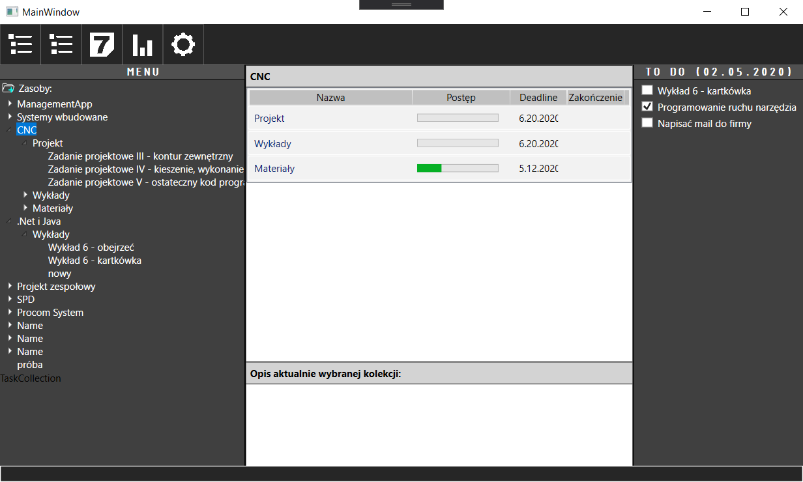

# 02_ManagementAppProject

## Wprowadzenie

Jest to projekt aplikacji desktopowej służącej do zażądzania czasem. W planach są takie funkcjonalności jak:

-   Dodawanie kolekcji, zadań i punktów
-   Ustawiane deadlinów, oraz dynamiczne decydowanie czym chcemy się zająć dzisiaj
-   Dodawanie czynności rutynowych (np. 30 min nauki angielskiego), oraz określenie w które dni mają być wykonywane
-   System kontrolowania postępów -> statystyki
-   Personalizowane ustawienia
-   Kalendarz

## Technologie i pakiety

-   C#
-   WPF
-   .NET Framework 4.7.2
-   Entiti Framework 6.2.0
-  Google.Apis.Calendar.v3 1.45.0
-  Newtonsoft.Json 12.0.3
-  MSTest.TestFramework 2.1.1
-  MSTest.TestAdapter 2.1.1

## Środowisko

-   Visual Studio 16.5.0

## Zakres funkcjonalności

### Zarządzanie

###### Obsługa:
Dzięki tej funkcjonalności możemy dodawać kolekcje, zadania i punkty, twożąc złożoną struktórę poprawiającą organizacje.
Z listy punktów możemy wybierać te które chcemy zrealizować danego dnia i w prosty sposób dodać do dziennego TO DO.
Potwierdzać ich wykonanie możemy już z w obszaże owej listy, tak by nie musieć za każdym razem na nowo oddnajdywać wszystkich punktów.
###### Status: Wstępnie zrealizowane
###### Plany rozwoju: 
 - [ ] Przenoszenie lub odwlekanie nie zrealizowanych punktów po zakończeniu dnia.
 - [ ] Działanie aplikacji w tle w celu przypominania o zbliżających się deadlinach.
 - [ ] Poprawa formatu wyświetlanej daty w listach zadań i punktów.
 - [ ] Poprawienie graficznych aspektów.

#### Rutyny
###### Status: Etap koncepcji
###### Plany rozwoju: 
 - [ ] Przygotowanie odpowiedniej struktury dla bazy danych.
 - [ ] Implementacja dodawania, usuwania i edycji rutyn.
 - [ ] Obrazowe wyświetlanie regularności na mini kalendarzu.
 - [ ] Opracowanie i wprowadzenie personalnych opcji dla rutyn.
#### Kalendarz

###### Obsługa:
Dzięki kalendarzowi możemy w łatwy sposób zorientować się w ilości zbliżających się deadlinów i odpowiednio na to reagować.
Ponadto istnieje możliwość wysłania i późniejszej synchronizacji zadań z kalendarzem google.
Klikając na konkretny dzień możemy podejrzeć więcej informacji o punktach z datą deadlinu przewidzianą na ten dzień. 
###### Status: Zrealizowane
#### Statystyki
###### Status: W planach
###### Plany rozwoju: 
 - [ ] Opracować koncepcje zbieranych statystyk.
 - [ ] Opracować wstępny graficzny interfejs.
#### Opcje
###### Status: W planach
###### Plany rozwoju: 
 - [ ] Opracować koncepcje personalnych opcji.
 - [ ] Opracować wstępny graficzny interfejs.
 - [ ] Dodanie personalnych opcji.
 - [ ] Wprowadzenie zależności do reszty funkcjonalności.

